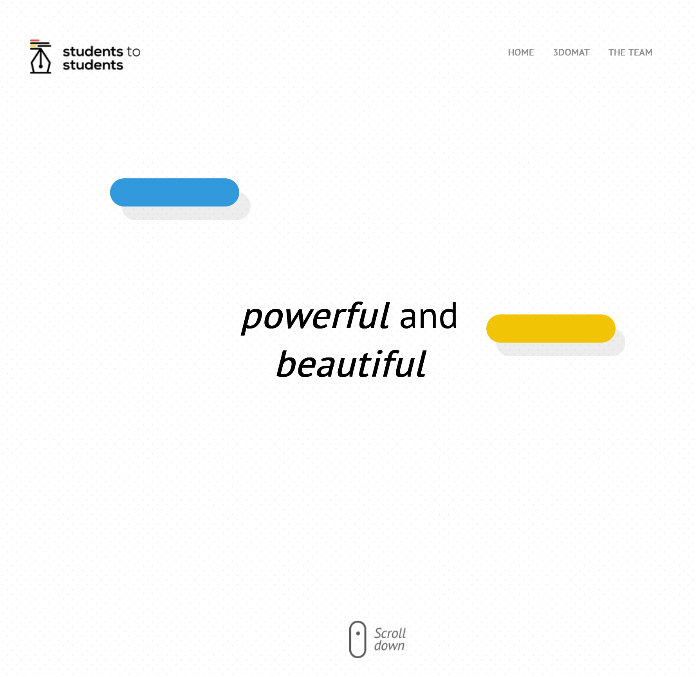
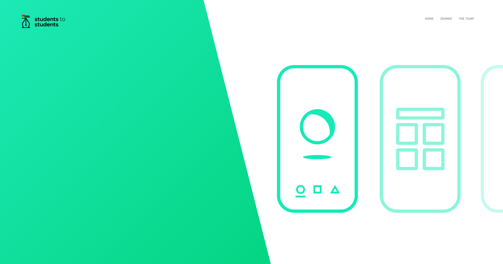
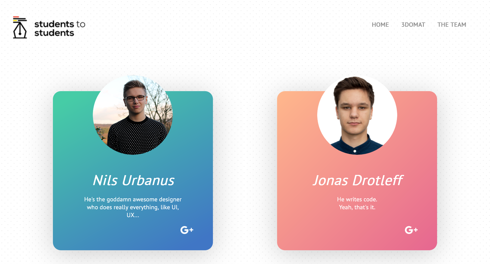

<h1 align="center"> Students to Students Site</h1>

This was a website I wrote early into my career. I'd done some programming up to this point,
but not much in the web development space.

This page includes some basic scrolling animations, a wonderful design by Nils, and a lot of paper-cut issues that would
ultimately kill the site if it were in production.

## Screenshots

## "TODO" Items

While I'll never revist working on this site, if I _were_ to redo it today, here's what I'd improve:

- [ ] SEO
- [ ] Accessibility
  - [ ] Keyboard focus doesn't work
  - [ ] Page zooming and font scaling doesn't work
-[ ] Fix responsiveness issues
  - On mobile, the page is too small to fit all the content
